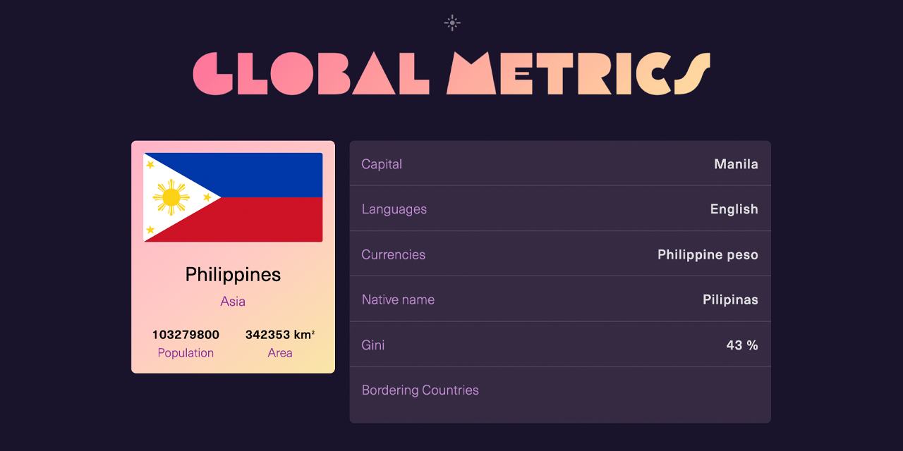

<p id="header"><p>

<table><tr>
<td> <a href="https://github.com/emjose/crypto-tracker/#header"></a> </td>
<td> <a href="https://github.com/emjose/one-hundred/#header"></a> </td>
<td> <a href="https://github.com/emjose/take-a-guess/#header"></a> </td> 
</tr></table>

<br>

<p id="project-title"><p>

<a href=#table-of-contents></a>

<br>

<a href="https://global-metrics-app.vercel.app/"></a>

#

<p id="table-of-contents"><p>

<a href=#table-of-contents></a>

-   [100 Days of Code](#100days)
-   [Installation](#installation)
-   [Live Site](#live-site)
-   [Resources](#resources)
-   [Let's Connect!](#lets-connect)

#

<p id="100days"><p>

<a href=#100days></a>

### Day 29: May 18, 2021

-   I worked on a great <a href="https://youtu.be/v8o9iJU5hEA">Next.js tutorial</a> by <a href="https://www.youtube.com/channel/UCmSmLukBF--YrKZ2g4akYAQ">Thu Nghiem</a> that uses the <a href="https://restcountries.eu/">REST Countries API</a>.

-   Countries of the world can be sorted by data, and the app is responsive with light and dark modes.

-   This app also gave me a better understanding of accessibility and the importance of focus state styling for keyboard-only navigation.

#

<p id="installation"><p>

<a href=#installation></a>

#### 1. Git clone and cd into the repo folder:

```console
git clone git@github.com:emjose/global-metrics-app.git && cd global-metrics-app
```

#### 2. Install dependencies:

```console
yarn install
```

#### 3. Run the development server:

```console
yarn dev
```

#### Open [http://localhost:3000](http://localhost:3000) with your browser to launch the Global Metrics app.

#

<p id="live-site"><p>

<a href="https://global-metrics-app.vercel.app/"></a>

<a href="https://global-metrics-app.vercel.app/"></a>

• <a href="https://css-tricks.com/having-a-little-fun-with-custom-focus-styles/">Custom focus styling</a> has been applied to nearly all elements for accessibility, and countries can be sorted by name, population, area, and <a href="https://www.investopedia.com/terms/g/gini-index.asp">Gini Index</a>.

• The Global Metrics app is responsive and has light and dark modes.

#

<br>

<a href="https://global-metrics-app.vercel.app/"></a>

Countries can be searched, filtered, and viewed with data from the <a href="https://restcountries.com/">REST Countries API</a>.

#

<p id="resources"><p>

<a href=#resources></a>

-   #### [REST Countries API Tutorial](https://youtu.be/v8o9iJU5hEA) by [Thu Nghiem](https://www.youtube.com/channel/UCmSmLukBF--YrKZ2g4akYAQ)

-   #### [REST Countries API](https://restcountries.com/)

-   #### [Adobe Fonts](https://fonts.adobe.com/)

-   #### [React Icons](https://react-icons.github.io/react-icons)

-   #### [Google Fonts](https://fonts.google.com/)

-   #### [CSS Gradient](https://cssgradient.io/)

-   #### [Custom Focus Styles](https://css-tricks.com/having-a-little-fun-with-custom-focus-styles/)

-   #### [React Scroll to Top Button](https://www.geeksforgeeks.org/how-to-create-a-scroll-to-top-button-in-react-js/)

-   #### [{Outline: none;} Don't Do It!](http://www.outlinenone.com/)

-   #### [The :focus-within CSS pseudo class](https://developer.mozilla.org/en-US/docs/Web/CSS/:focus-within)

-   #### [My blog on how I created my Github READMEs](https://emmanueljose.medium.com/readme-a-makeover-story-b9c7be37a6de?sk=7ae6623d365409d875753e4604e42ffd)

#

<p id="lets-connect"><p>

<a href=#lets-connect></a>

<p><a href="https://twitter.com/Emmanuel_Labor"></a> <a href="https://www.linkedin.com/in/emmanuelpjose/"></a> <a href="https://emmanueljose.medium.com/"></a> <a href="https://www.instagram.com/emmanuel_jose/"></a> <a href="mailto:emjose@gmail.com"></a> <a href="https://www.emmanuel-jose.com/"></a> <a href="https://github.com/emjose"></a></p>

#

<a href=#header></a>

<!-- This is a [Next.js](https://nextjs.org/) project bootstrapped with [`create-next-app`](https://github.com/vercel/next.js/tree/canary/packages/create-next-app).

## Getting Started

First, run the development server:

```bash
npm run dev
# or
yarn dev
```

Open [http://localhost:3000](http://localhost:3000) with your browser to see the result.

You can start editing the page by modifying `pages/index.js`. The page auto-updates as you edit the file.

[API routes](https://nextjs.org/docs/api-routes/introduction) can be accessed on [http://localhost:3000/api/hello](http://localhost:3000/api/hello). This endpoint can be edited in `pages/api/hello.js`.

The `pages/api` directory is mapped to `/api/*`. Files in this directory are treated as [API routes](https://nextjs.org/docs/api-routes/introduction) instead of React pages.

## Learn More

To learn more about Next.js, take a look at the following resources:

- [Next.js Documentation](https://nextjs.org/docs) - learn about Next.js features and API.
- [Learn Next.js](https://nextjs.org/learn) - an interactive Next.js tutorial.

You can check out [the Next.js GitHub repository](https://github.com/vercel/next.js/) - your feedback and contributions are welcome!

## Deploy on Vercel

The easiest way to deploy your Next.js app is to use the [Vercel Platform](https://vercel.com/new?utm_medium=default-template&filter=next.js&utm_source=create-next-app&utm_campaign=create-next-app-readme) from the creators of Next.js.

Check out our [Next.js deployment documentation](https://nextjs.org/docs/deployment) for more details. -->
